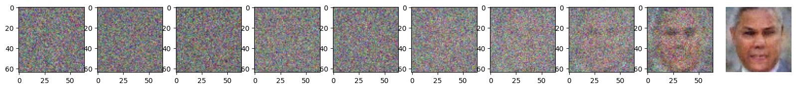
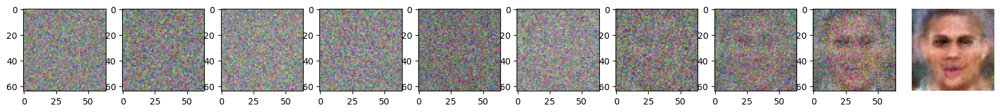
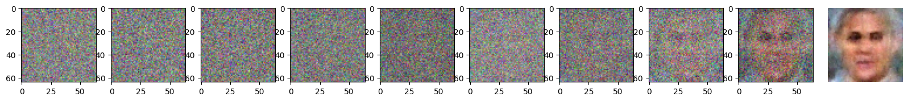

# Stable Diffusion

This code implements a simple version of stable diffusion from scratch in TensorFlow.
The explainer for this code is [over here](https://stealthypanda.github.io/whatisx/stablediffusion).

The performance of a ~14M parameter model is shown below (trained on a faces dataset):

